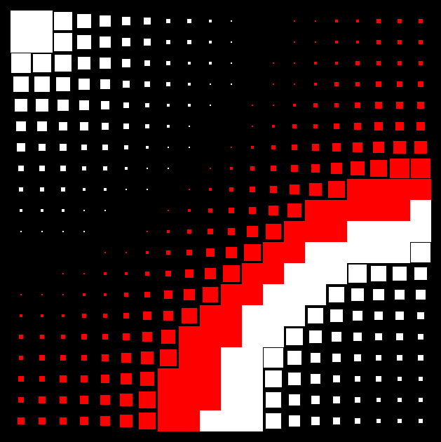

# tixy.rb
TIXY, but in Ruby using Gosu
inspired by https://tixy.land/

In the code there are some flags to toggle diffrent rendering modes.

def tixy(t, i, x, y)
   (x&y)*sin(t) * ((x^y)-i/((t%8)+1)**1.8)
end

contains the function. execute file to view the visual

